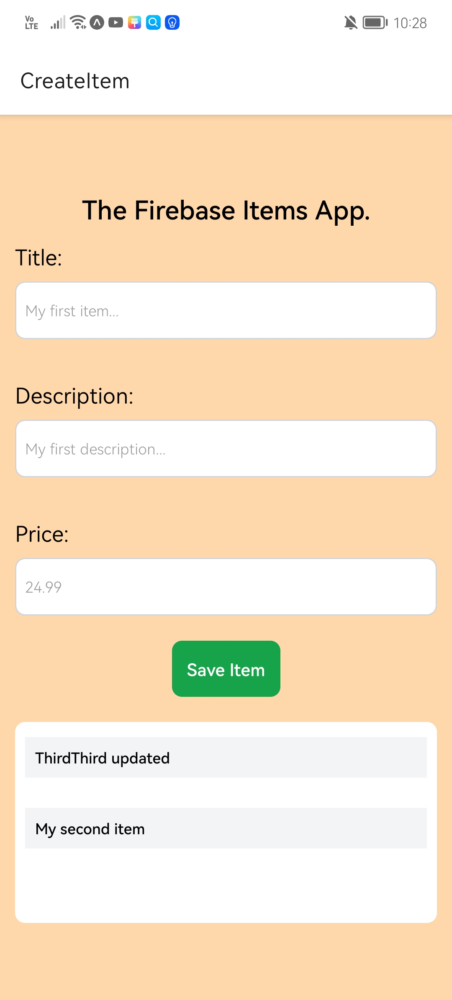
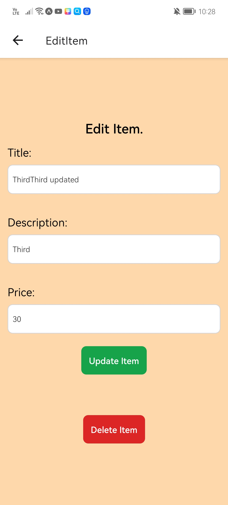

# The Items App.

The Items App allows users to create, edit, update and delete items from the database.
A Firebase database was created in order to store all the items typped by the user.

Each item has the next properties:
- Title.
- Description.
- Price.

## Screenshots.

  
  

## Author.

- Jorge Ortiz.
- Software engineer.
- San Luis Potosí, S.L.P. México.
